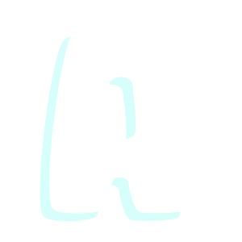
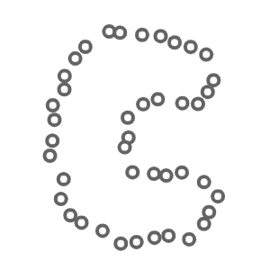

# Animated Font 📝

The beginnings of a library that extends p5's text displaying functions, adding a number of pre-made animation styles.

| Style        | Class Name    | Example |
| -------------|---------------|:-------:|
| Glitch       | GlitchLetter  ||
| Rainbow      | RainbowLetter ||
| Dots         | DotsLetter    ||
| Wavey        | WaveLetter    ||
| Neon         | NeonLetter    ||
| Lines        | LinesLetter   ||
